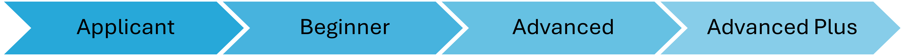

---

# Qualified Participants

The AIVS has fostered a growing community of qualified participants who have completed the program. These participants represent a diverse group of students who have demonstrated their dedication to AI education and research.

## Certification Levels

Participants in the AIVS program can achieve three certification levels based on their performance and continued involvement:

- **Beginner**: Successfully completed program requirements
- **Advanced**: Contribution to the program and previous completion of Beginner level
- **Advanced Plus**: Significant contribution to the program, and previous completion of Advanced level

Additionally, we recognize participants from the initial program stages before the current level system was established.

## Qualified Participants Categorized by their Final Level
### Beginner Group
| Session | Name | Current Affiliation |
|---------|------|---------------------|
| 2025 AIWS | Jaeyoung Lee | Undergraduate student|
| 2025 AIWS | Junhui Lee | Undergraduate student|
| 2025 AIWS | Jongwon Shin | Undergraduate student|
| 2025 AIWS | Sunjai Hwang | Undergraduate student|
| 2024 AISS | Kyoung Kwak | Social Service Agent |
| 2024 AIWS | Jiwon Im | Undergraduate student|
| 2023 AISS | Yujin Sung |Graduate school - KAIST, Korea |
| 2023 AISS | Jihun Kwon |Social Service Agent  |
### Advanced Group
| Session | Name | Current Affiliation |
|---------|------|---------------------|
| 2025 AIWS | Selin Yang | Undergraduate student|
| 2025 AIWS | Narim Kim | Undergraduate student|
| 2025 AIWS | Seonil Jee | Undergraduate student|
| 2025 AIWS | Subin Hyun | Undergraduate student|
| 2024 AISS | Chae Eon Rhee | Undergraduate student|
| 2024 AIWS | Dahee Kim | Undergraduate student|
| 2023 AISS | Minjae Chung | Graduate student |
| 2023 AIWS | Jinsung Oh | Graduate student |
| 2023 AIWS | Yejin Lee | Graduate student |
### Advanced Plus Group
| Session | Name | Current Affiliation |
|---------|------|---------------------|
| 2025 AIWS | Gaeun Oh | Undergraduate student|
| 2024 AISS | Taekeun Kim | Undergraduate student|
| 2024 AISS | Dongin Moon |Undergraduate student |
| 2024 AISS | Yujin Kim | Graduate school - Ghent University, Belgium |
| 2023 AISS | Jongbum Won |Social Service Agent |
| 2023 AISS | Ganghyun Kim | Graduate school - UNIST, Korea|
### Initial Stage Group
Participants who joined before the certification level system was established.

| Session | Name | Current Affiliation |
|---------|------|---------------------|
| 2021 AISS | Jihwan Lim |Graduate school - Ghent University, Belgium|
| 2021 AIWS | Ilho Yun | Graduate school - Seoul National University, Korea|
| 2021 AIWS | Jinny Chun |Graduate school - Ghent University, Belgium|
| 2021 AIWS | Haeun Lee | |
| 2020 AISS | Sanghyeon Park | Visiting researcher - Scripps Institute in San Diego, California |
| 2020 AISS | Jiyeon Baek | |

## Participant Achievements

You can find the participants' presentations and posters [here](./showcases.md), and their contributed research outcomes [here](./collaborations.md).

*Note: This list represents participants who have completed the program as of February 2025. Current affiliations will be updated as information becomes available.*

---

[Return to Main Page](./readme.md#Table-of-Contents)

