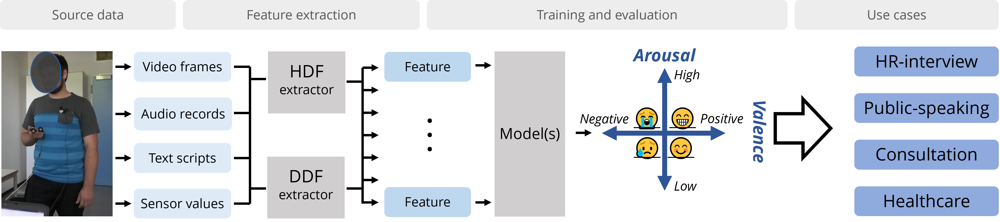

# Research Collaborations

The AI Vacation School (AIVS) program has fostered student participation in academic research, resulting in contributions to peer-reviewed publications, software development, and dataset creation. This page documents the research outputs where AIVS participants (highlighted in **bold**) have been directly involved.

In addition to the work listed here, we are actively engaged in various interdisciplinary research collaborations and provide customized self-study guidance for research collaborations. For inquiries about collaborative research or interdisciplinary studies please contact us at homin.park@ghent.ac.kr or wesley.deneve@ghent.ac.kr.

## Research Outcomes

### Journals

- Ho-min Park, **Ganghyun Kim**, **Jinsung Oh**, Arnout Van Messem, and Wesley De Neve. 2024. Interpreting Stress Detection Models using SHAP and Attention for MuSe-Stress 2022. IEEE Transactions on Affective Computing.

- Ho-min Park, **Jongbum Won**, Yunseol Park, Esla Timothy Anzaku, Joris Vankerschaver, Arnout Van Messem, Wesley De Neve, and Hyunjin Shim. 2023. CRISPR-Cas-Docker: Web-Based In Silico Docking and Machine Learning-Based Classification of crRNAs with Cas Proteins. BMC Bioinformatics, 24(1), 167.

- Ho-min Park, **Sanghyeon Park**, Maria Krishna de Guzman, **Ji Yeon Baek**, Tanja Cirkovic Velickovic, Arnout Van Messem, and Wesley De Neve. 2022. MP-Net: Deep Learning-based Segmentation for Fluorescence Microscopy Images of Microplastics Isolated from Clams. PLoS ONE 17(6): e0269449.

### Proceedings

- Ho-min Park, **Ilho Yun**, Mijung Kim, Khoa Tuan Nguyen, Arnout Van Messem, and Wesley De Neve. 2024. Interpretable Rotator Cuff Tear Diagnosis Using MRI Slides with CAMscore and SHAP. In Medical Imaging 2024: Computer-Aided Diagnosis (Vol. 12927, pp. 683-693). SPIE.

- Ankit Kumar Singh, **Ganghyun Kim**, Jaeheon Kim, Ho-min Park, Bong Jun Choi, and Wesley De Neve. 2024. Exploring Multimodal Approaches and Fusion Methods for CEO Social Attribute Prediction in 2024 MuSe-Perception. In Proceedings of the 5th on Multimodal Sentiment Analysis Challenge and Workshop.

- Ho-min Park, **Ganghyun Kim**, Arnout Van Messem, and Wesley De Neve. 2023. MuSe-Personalization 2023: Feature Engineering, Hyperparameter Optimization, and Transformer-Encoder Re-Discovery. In Proceedings of the 4th Multimodal Sentiment Analysis Challenge and Workshop.

- Ho-min Park, **Ilho Yun**, Ajit Kumar, Ankit Kumar Singh, Bong Jun Choi, Dhananjay Singh, and Wesley De Neve. 2022. Towards Multimodal Prediction of Time-Continuous Emotion Using Pose Feature Engineering and a Transformer Encoder. In Proceedings of the 3rd International on Multimodal Sentiment Analysis Workshop and Challenge.

- **Ji Yeon Baek**, Maria Krishna de Guzman, Ho-min Park, **Sanghyeon Park**, Boyeon Shin, Tanja Cirkovic Velickovic, Arnout Van Messem, and Wesley De Neve. 2021. Developing a Segmentation Model for Microscopic Images of Microplastics Isolated from Clams. In Pattern Recognition, ICPR International Workshops and Challenges.

### BSc projects

- **Ilho Yun**, **Seung Chan Oh**, **Minji You** (2023): Automated diagnosis of rotator cuff tears on shoulder MRI with deep learning

- KeonOh Kim, **Jinny Chun**, **Hyunjung Lee**, Solha Kang (2022): Towards robust peritoneal tumor diagnosis: Deep learning-based binary classification and detection of tumors

- **Sanghyeon Park** (2021): Microplastics segmentation from fluorescence microscopy images for marine pollution monitoring: An investigation of deep convolutional neural networks and test-time augmentation

- **Ji Yeon Baek** (2021): Microplastics segmentation from fluorescence microscopy images for marine pollution monitoring: A comparative investigation of deep discriminative and generative models

- **Jinyong Park** (2021): MRI classification for brain tumor detection using deep evolutionary neural networks

- Seungjin Kim (2021): ACL tear diagnosis in 3-D MRI through deep learning

## Software and Web Services

### Web Services

- **CRISPR-Cas-Docker (CCD)**: A web-based bioinformatics tool for predicting interactions between CRISPR RNAs (crRNAs) and Cas proteins. Users can provide experimentally obtained 3-D structures or use prediction tools. CCD generates top-10 docking models using HDOCK, optimizing crRNA-Cas protein combinations before laboratory experiments.
  - **Contributors**: Ho-min Park, **Jongbum Won**
  - **URL**: [http://www.crisprcasdocker.org/](http://www.crisprcasdocker.org/)

### Software Tools

- **MuSe-Personalization 2023 Code**: Implementation of the FeelsGood team that participated in the MuSe-Personalization track of the MuSe 2023 Challenge, achieving 2nd place. The model detects stress levels through multimodal emotion analysis using a Transformer Encoder.
  - **Contributors**: Ho-min Park, **Ganghyun Kim**
  - **Repository**: [GitHub - MUSE2023_clean](https://github.com/kyleok/MUSE2023_clean)

- **MuSe 2022 Multimodal Model**: Code submitted by the FeelsGood team for the MuSe 2022 Challenge, featuring a Transformer Encoder added to an LSTM model for time-continuous emotion prediction. Includes pose feature extraction and both single-modal and multi-modal models.
  - **Contributors**: Ho-min Park, **Ganghyun Kim**
  - **Repository**: [GitHub - MuSe2022FeelsGood](https://github.com/powersimmani/MuSe2022FeelsGood)
    
- **Microplastics Annotation Package (MAP)**: A user-friendly tool for microplastics monitoring that performs both annotation tasks and monitoring. Features include fluorescent MP label editing, threshold model comparison, visualization and quantitative analysis of MP particles, and model training using user data.
  - **Contributors**: Ho-min Park, **Sanghyeon Park**, **Ji Yeon Baek**
  - **Repository**: [GitHub - Microplastics-Annotation-Package](https://github.com/powersimmani/Microplastics-Annotation-Package)

- **MP-Net**: A deep learning-based segmentation model for fluorescence microscopy images of microplastics isolated from clams. Includes source code, pre-trained weights, and scripts to reproduce research results.
  - **Contributors**: Ho-min Park, **Sanghyeon Park**, **Ji Yeon Baek**
  - **Repository**: [GitHub - MP-Net](https://github.com/powersimmani/MP-Net)

### Datasets

- **MPSet**: A dataset of microplastics images visualized through Nile Red staining and manually annotated masks. Includes a spiked dataset with HDPE and PET particles and a clam dataset with microplastics from non-synthetic environments.
  - **Contributors**: Ho-min Park, **Sanghyeon Park**, **Ji Yeon Baek**
  - **Dataset**: [Kaggle - MPSet](https://www.kaggle.com/datasets/sanghyeonaustinpark/mpset)

---
[Return to Main Page](./readme.md)
