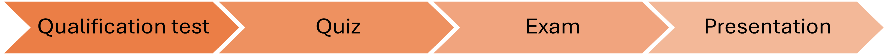

---
# Selection and Evaluation

The AI Vacation School (AIVS) employs a structured selection and evaluation system to ensure participants receive the maximum benefit from the program.

## Selection Process

Qualification Test
All prospective participants must pass a qualification test to join the program. This test assesses:

Basic mathematical knowledge:

Basic linear algebra (10 problems)
Basic calculus (10 problems)

Programming skills:

Basic Python (5 problems)
Advanced Python (5 problems)

Participants are selected based on test scores, with a maximum of 4 candidates chosen according to highest scores.

## Evaluation Methods

AIVS uses a three-stage evaluation process throughout the program:

### 1. Quiz
- **Timing**: First day of the Main-session
- **Content**: Comprehensive assessment covering fundamental concepts in Linear Algebra, Calculus, Machine Learning, Deep Learning, Computer Structure, Networks, and Operating Systems
- **Format**: Mixture of conceptual questions, mathematical problems, and application scenarios
- **Purpose**: To verify self-learning of fundamental concepts and provide preparation for future graduate school interviews
- **Development**: Created by student volunteers from the Advanced group

### 2. Exam
- **Timing**: End of the Main-session (January 16, 2025)
- **Format**: Comprehensive assessment covering all Main-session material including:
   * Artificial Neural Networks (ANNs)
   * Convolutional Neural Networks (CNNs)
   * Loss Functions and Evaluation Metrics
   * Model Evaluation and Selection
- **Purpose**: To evaluate understanding of core AI concepts through practical problem solving

### 3. Seminar Presentation
- **Timing**: During the Self-study phase following the Main-session
- **Format**: Technical presentation with Q&A before an audience of professors, PhD students, and peers
- **Content**: Presentation of independent research projects and findings
- **Environment**: Formal academic setting with invited experts from RC4 and students interested in AI
- **Preparation**: 
   * Each student receives at least two 2-hour rehearsal sessions
   * Personalized guidance to develop complete presentation materials
   * Practice for polished delivery
- **Evaluation**: Feedback from professors, TAs, and peers
- **Purpose**: 
   * To develop presentation skills for academic and professional settings
   * To receive project feedback from experts in the field
   * To build experience presenting technical content
   * To create materials that demonstrate research experience for future applications
- **Documentation**: Presentations are recorded and linked for future reference

---
[Return to Main Page](./readme.md#Table-of-Contents)
