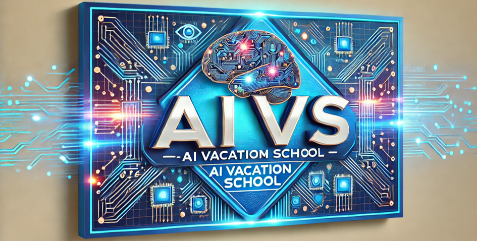

# AI Vacation School

## Introduction

**AI Vacation School (AIVS)** is a specialized artificial intelligence (AI) bootcamp organized by the Center for Biosystems and Biotech Data Science at Ghent University Global Campus for undergraduate students. The program delivers intensive AI education and hands-on project experience during summer and winter vacations.

AIVS provides students with comprehensive exposure to everything from AI fundamentals to the latest trends through a systematic curriculum that integrates theoretical knowledge with practical skills.

## Program Features

- **Intensive Training**: Over 100 hours of AI learning and personalized project work during vacation periods
- **Progressive Growth**: Level-based programs divided into Beginner, Advanced, and Advanced Plus groups
- **Practical Experience**: Research experience through seminar presentations and poster sessions
- **Career Development**: Portfolio and recommendation letters to support graduate school admission and job applications
- **Community**: Networking opportunities with like-minded students and researchers

## Table of Contents

- [Purpose and Objectives](purpose.md)
- [Curriculum](curriculum.md)
- [Selection and Evaluation](evaluation.md)
- [Presentation Materials](showcases.md)
- [Research Collaborations](collaborations.md)
- [Qualified Participants](alumni.md)

## Key Schedule

- **Pre-session**: online learning by curated lectures  (2 weeks)
- **Main-session**: 
  - Week 1: Basic ML concepts (evaluation, loss, optimization, ANN, CNN)
  - Week 2: Advanced ML concepts (RNN, transformers, GAN, self-supervised learning)
- **Self-study**: Independent research and project development (4 weeks)
- **Presentations**: Oral and poster presentations

## Contact

For inquiries about educational materials and curriculum, please contact:
- Email: homin.park@ghent.ac.kr

---

© 2025 AI Vacation School - All Rights Reserved
